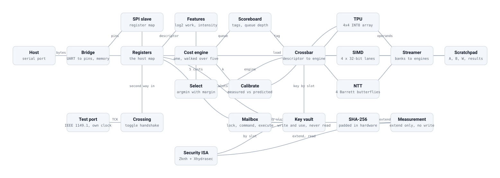
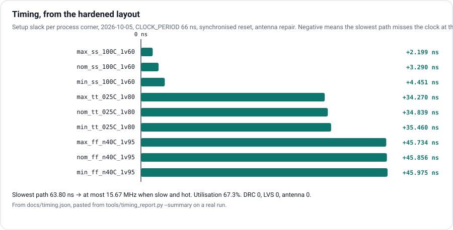
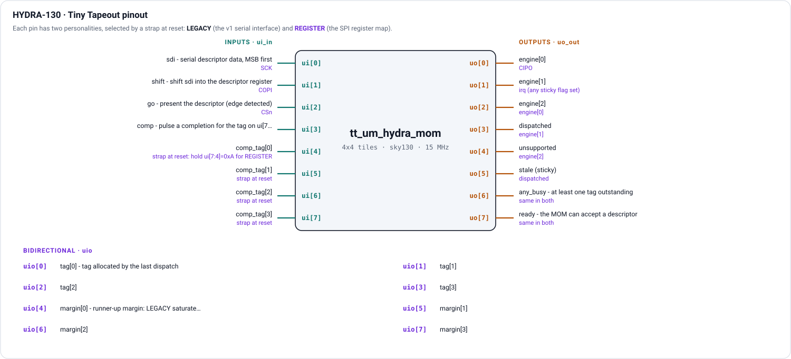
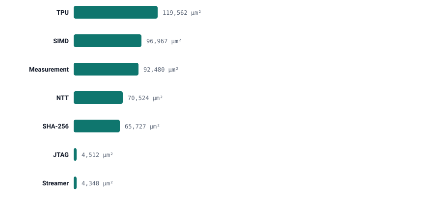
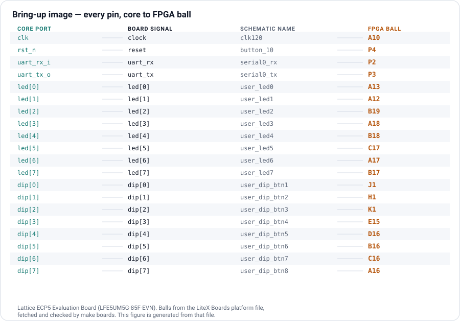
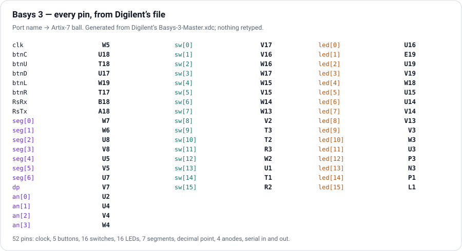

<p align="center">
  
</p>

<p align="center">
  <a href="https://github.com/Normansrule/hydra-skywater130/actions/workflows/verify.yml"></a>
  &nbsp;<a href="https://github.com/Normansrule/tinytapeout-hydra">Tiny Tapeout tile</a>
  &nbsp;·&nbsp;<a href="docs/site/index.html">project page</a>
  &nbsp;·&nbsp;<a href="docs/FIRST_TRY.md">first run</a>
  &nbsp;·&nbsp;<a href="docs/SECURITY_PLAN.md">security plan</a>
</p>

**A robotics and security chip for SkyWater's open 130 nm process, built to go
all out: CPU, GPU and TPU on one die, with a hardware scheduler between them.**
The scheduler predicts how long each of five compute engines would take a
piece of work, sends it to the cheapest, measures what really happened and
corrects itself. Around it: a systolic matrix array (the TPU), a vector unit,
a lattice-crypto transform engine, a root-of-trust block modelled on
Caliptra's discipline, two independent ways in for debugging, and a bring-up
image for a real FPGA board. A RISC-V CPU and a GPU join next (see
[the plan](#cpu-and-gpu-what-joins-next)). Every block is checked against an
independent model, and every claim on this page is generated from, or checked
against, the repository itself.

**Two repositories, two jobs.** This one is the product: the whole chip, every
engine, every interface. The [Tiny Tapeout tile](https://github.com/Normansrule/tinytapeout-hydra)
is the research experiment: the scheduler alone, cut to the cost model, its
calibration and an SPI register map, on 12 tiles instead of 16. The two share
the scheduler's modules byte for byte (`make tile-shared`), so the chip's
verification of them covers the tile.



| | |
|---|---|
| **Tiny Tapeout research tile** | v3 on 3×4 tiles, harden pending · v2 on 4×4 **hardened: layout versus schematic match, design rules and antenna clean**, 67.3% utilisation |
| **Clock** | 15.15 MHz (66 ns) — **every corner meets setup**; slow-corner slack +2.20 ns; sign-off clean |
| **Dispatcher** | roofline cost model over five engines, self-calibrating, ~13-cycle decision |
| **Compute engines** | 4×4 INT8 systolic array · 4-lane 32-bit vector unit · Barrett butterflies at the ML-KEM, ML-DSA and Falcon moduli |
| **Memory path** | scratchpad banks and an operand streamer feeding all three engines |
| **Root of trust** | key vault (write, use, never read) · Caliptra-style mailbox · SHA-256 · extend-only measurement register |
| **Instruction set** | ratified RISC-V Zknh SHA-256 instructions + a custom `Xhydrasec` extension — no key-read instruction exists |
| **Debug and programming** | serial bridge **and** an IEEE 1149.1 test port with its own clock, crossing into the register map through a verified handshake |
| **FPGA** | Lattice ECP5 evaluation board (six images) and **Digilent Basys 3** (Artix-7), each with a bring-up image |
| **Verification** | independent models, 20+ formal proofs, non-interference proofs for key secrecy, mutation testing of the benches |

## Everything on the chip

| block | what it does | on the Tiny Tapeout tile? |
|---|---|---|
| **Dispatcher** | roofline cost model over five engines, self-calibrating from measured completion times | **yes — this is the tile** (4 tags; the chip has 8) |
| **Two pin personalities** | v1 serial interface, or an SPI register map reaching the whole dispatcher | SPI map only (`mom/hydra_mom_pins.sv` on the chip) |
| **4×4 INT8 systolic array** | matrix multiply, 640 results exact against its model | full chip and FPGA |
| **4-lane 32-bit vector unit** | eight operations, elementwise and reductions | full chip and FPGA |
| **Number-theoretic transform engine** | Barrett butterflies at the ML-KEM (3329), ML-DSA (8380417) and Falcon (12289) moduli | full chip |
| **Scratchpad and operand streamer** | banks the host loads; feeds all three engines | full chip and FPGA |
| **Key vault** | keys written and used by slot, never read back — proved | full chip |
| **Mailbox** | Caliptra's read-to-acquire lock protocol; mutual exclusion proved | full chip |
| **SHA-256** | block compression, identical to `hashlib`; **padded in hardware** — padding proved unbounded | full chip |
| **Image measurement** | image bytes in, SHA-256 padded in hardware, PCR extended — software never handles the digest; one shared hash core | full chip |
| **Measurement register** | extend-only, fixed padding, no write port — proved | full chip |
| **Security instructions** | ratified Zknh + custom `Xhydrasec`; no key-read instruction exists | full chip (unit verified, not yet in a core) |
| **IEEE 1149.1 test port** | its own clock; reset from any state proved; crosses into the register map by handshake | full chip |
| **Serial bridge** | the host link: commands, memory reads and writes | FPGA |
| **Bring-up image** | LED walk, switch mirror, switch naming, serial echo | FPGA |
| **Basys 3 bring-up** | all 16 LEDs and switches, 5 buttons, the four-digit display, serial | FPGA (Basys 3) |
| **RISC-V CPU** | [Sixfold](https://github.com/Normansrule/sixfold-cpu): six-stage RV64IM + B + Zknh, cycle-exact against its model | next: joins the chip |
| **GPU** | [Pixelstorm](https://github.com/Normansrule/pixelstorm-gpu) | next: joins the chip |

## CPU and GPU: what joins next

The chip's scheduler already chooses between five engines; three of them are
built here (the TPU array, the vector unit, the transform engine). The CPU and
GPU come from their own repositories, where each is verified on its own:

- **CPU: Sixfold**, a six-stage RV64IM core with the bit-manipulation
  extension and, since 2026-10-09, the Zknh SHA-2 instructions, checked cycle
  for cycle against a software twin. On HYDRA it also takes `Xhydrasec`, user
  mode and the illegal-instruction trap, so the key vault is reachable only
  through instructions that cannot read a key.
- **GPU: Pixelstorm**, attached to the scheduler as one more engine behind the
  same port contract as the others.

Neither is wired in yet, and nothing on this page counts them as done. The
research tile will never carry them: it measures the scheduler alone.

## Watch a decision being made


## Explore it

**[Open the project page](docs/site/index.html)** — the interactive block
diagram, the area of every block to scale, the one-engine-for-five sweep drawn
against time, and every check grouped by what it actually establishes. It is
one self-contained file, generated by `make site`.

## The chip, as fabricated


*The real hardened layout of the Tiny Tapeout tile — rendered from the GDS by
Tiny Tapeout's own tool, not drawn. Regenerate with the commands at the end.*

## Timing, from the real layout



**Timing is closed at every corner** at 66 ns (15.15 MHz): worst slow-corner
setup slack **+2.184 ns**, hold clean everywhere. Getting there took two runs at
the same clock. The first still failed at the slow corner, which ruled out
logic depth: lengthening the clock 55 → 66 ns should have bought about 9 ns on
any ordinary path. The cause was the reset — the `rst_n` pin drove about 2,500
asynchronously reset flip-flops directly, so every recovery check started at a
pin. With the reset released through a two-stage synchroniser, the same 66 ns
clock closes.

**Sign-off is clean** (2026-10-05): design rules, layout versus schematic and
antenna all zero. One antenna net had survived the default three repair passes;
six passes with a wider margin cleared it. Slew and capacitance warnings (5,039
and 20) remain — the flow reports them but does not count them toward
sign-off, and they are the next thing to understand.

**The hardened v2 netlist passes all 17 of its tile tests** (2026-10-07), the same suite
as at register-transfer level, run gate by gate on the layout's own netlist.
The first attempt passed 10: the hardening checkout held an older `test.py`
that read the result 16 cycles before the shared cost engine produces it.
`sync-tile` now proves the tests match, not only the design. The v3 research
tile (18 tests, 3×4) has not been hardened yet; everything in this section is
v2's.

## Pinout



Every pin has two personalities, chosen by a strap at reset. The figure is
drawn from `tt/tile/info.yaml`, the same file the shuttle reads, so the two
cannot disagree.

## Where the silicon goes



Five copies of the cost engine were once the largest thing on the tile — the
reason the first harden ran out of room at 98.8% placement density. Walking
one engine over the five parameter rows made the tile **26% smaller** and let
it harden. A separate bench proves the shared version makes the same decision
as the parallel one on every descriptor.

## On a real board




Flash the bring-up image before anything else: an LED walks at power-on (and
shows LED polarity in the first second), each switch drives its own LED, a
pattern mode names the switch it saw change, and the serial port echoes. If it
misbehaves, the fault is in the setup, not the design. **[Step-by-step guide,
datasheets and flashing](docs/FPGA_BRINGUP.md).**

### On a Digilent Basys 3


The Basys 3 image tests everything the board has: the display shows `HYdr`
for two seconds — every digit distinct, so inverted polarity is unmistakable —
then the sixteen switches as hex; each direction button lights its own
pattern; the centre button resets. It reuses the verified ECP5 bring-up core
unchanged for the lower LEDs, switches and serial port. Constraints are
Digilent's own master file with the right lines uncommented, never retyped.



**[Basys 3 guide: documents, Vivado, flashing, test table](docs/FPGA_BASYS3.md).**

## Security, stated precisely

| guarantee | how it is established |
|---|---|
| No instruction can move key bits into a register | non-interference over the instruction unit and key vault, **proved unbounded at the shipped size**; checked for teeth by re-injecting a one-bit leak |
| Key writes need machine mode and trap elsewhere | proved for all operands |
| The key vault's host port carries no key bits | non-interference, **proved unbounded at the shipped size** (4 × 256-bit slots); checked for teeth |
| Two requesters never both hold the mailbox lock | proved, unbounded |
| The measurement register moves only by extending | proved, unbounded; chain checked against `hashlib` |
| SHA-256 | seven messages straddling the 55/56-byte padding boundary, identical to `hashlib` |
| SHA-256 is of exactly the bytes sent | padding done in hardware: every length 0–130 bytes and boundaries to 1,000 identical to `hashlib`; marker, zeros and length field **proved unbounded** for every input sequence and core latency |
| An image is measured without software touching the digest | seven images measured into the PCR, digest and chain identical to `hashlib`; **proved unbounded** that the PCR moves only as an extend finishes and software has no path into the hash while it does |

**Not claimed:** resistance to power or timing analysis, fault injection, or
a physical attacker. Fully homomorphic encryption is **not** on this chip —
the transform engine is the primitive beneath lattice cryptography, and
ML-KEM and ML-DSA are the reachable targets. See
[the security plan](docs/SECURITY_PLAN.md) and [the instruction set](docs/ISA_SECURITY.md).

### A boot image, measured with no software in the way

Software hands over the image's bytes and nothing else. The hardware counts
them, writes the padding itself, hashes the block and extends the measurement
register, so the record says what was actually loaded.

<p align="center"></p>

### Why the key vault cannot leak, as a proof

Two copies of the vault get the same commands and different keys. The proof
shows their host-visible outputs agree on every cycle, for every key, with
no bound on how long it runs. A planted leak breaks the agreement, and the
proof names the cycle.

<p align="center"></p>

## Verification

`make verify` runs every check below in about five minutes and prints
`=== all checks passed ===`.

| area | what is checked | evidence |
|---|---|---|
| Dispatcher | 18 research-tile tests over SPI; the chip's dispatcher equals v1 pin for pin; shared engine decides as parallel; tile and chip share the modules byte for byte | simulation · differential · equivalence |
| Engines | array, vector unit, transform engine against models written from the contract | 1,600+ results exact |
| Memory path | all three engines fed from banks the host loads | 254 results read back |
| Formal | port contracts, key secrecy, hardware padding, image measurement, mailbox exclusion, test-port reset from any state | 25 proof runs over 15 modules |
| Tests of the tests | deliberate faults injected into each design | 50+ killed, survivors explained |
| Tile submission | metadata, pinout, docs, regeneration, stale claims | `make tt-ready` |

Two results are explained rather than hidden: a mutation that removes a clock
synchroniser survives *every* simulation (metastability is physical, not
functional), so it is caught by a structural check instead; and two
mutations are proven equivalent, with the reasoning written beside them.

## Build it

```bash
mkdir -p ~/src && cd ~/src
git clone --recurse-submodules https://github.com/Normansrule/hydra-skywater130.git
cd ~/src/hydra-skywater130
make bootstrap        # fetch vendor board files, check the toolchain
make verify           # everything, about five minutes
```

| command | what it does |
|---|---|
| `make doctor` | which tools are present, and how to install the rest |
| `make site` · `make readme-art` | regenerate the project page and every figure here, from the repository's data |
| `make selftest-bit` · `make flash-selftest` | build and load the ECP5 bring-up image |
| `make basys3-bit` · `make flash-basys3` | build (Vivado) and load the Basys 3 bring-up image |
| `make tt-ready` · `./scripts/sync-tile.sh` | check the tile, then copy it to the hardening checkout by hash |
| `./scripts/release.sh -m "…"` | verify, then push tile and parent in the right order |

---

# Engineering notes

The rest of this file is the engineering record: what was built, what went
wrong, and how each problem was found.

Each chapter opens on its own.

<details>
<summary><b>1. What the chip does</b></summary>

Software hands the chip a **work descriptor**: "multiply these 8×8×8 INT8
matrices, I care about latency, I do not care about power." The MOM evaluates a
roofline cost model for every engine that is *capable* of that operation and
data type, picks the cheapest, allocates a tag and dispatches it. When the
engine finishes, the measured time updates that engine's calibration factor, so
the next prediction is better.

Two things make that unusual:

1. **The decision is hardware, not a scheduler.** About thirteen cycles with
   the shared cost engine (three when five engines ran in parallel), no
   software in the loop, so it fits inside a control loop rather than around
   one.
2. **The model corrects itself.** An analytical roofline model is cheap and
   always wrong; this one measures what happened. Measured: with the TPU far
   slower than modelled, the decision margin falls 136 → 1 over 18 dispatches
   and the 19th picks a different engine.

### The five engines

| id | engine | what it is for |
|---|---|---|
| 0 | CPU | scalar RISC-V pipeline; the fallback that can execute anything |
| 1 | SIMD | 4-lane 32-bit vector unit |
| 2 | TPU | 16×16 INT8 output-stationary systolic array |
| 3 | NTT | 8-butterfly number-theoretic transform, for lattice cryptography |
| 4 | CRYPTO | AES / SHA / HMAC datapath |

Capability is a hard gate, not a preference: an engine that cannot represent
the data type, or cannot perform the operation class, is removed before any
cost is compared. The exact masks are in `docs/ISA.md`.

### What is built here, and what is not

Built and verified: the dispatcher (the tile), the **engine crossbar** that
carries a decision out and the completion back, the pad multiplexer, the reset
synchroniser, the chip wrapper, and the FPGA bench platform. On the board the
loop closes with engines in hardware and no host involvement.

**The engines themselves are latency models in this repository.** They take
work, wait the modelled number of cycles, and report done — exactly the part of
an engine the cost model claims to predict. The real datapaths live in the
HYDRA-130 tree and attach to the crossbar's engine ports (section 5).

</details>

<details>
<summary><b>2. Pins</b></summary>

### 2.1 The dispatcher's 24 pins — chip, and research tile

The dispatcher sits behind 24 signal pins: 8 in, 8 out, 8 bidirectional, plus
`clk`, `rst_n` and `ena` — a Tiny Tapeout tile's interface, kept on the chip
as `mom/hydra_mom_pins.sv`. On the chip it has **two personalities**, chosen
by a strap sampled while reset is low. The **research tile (v3) has only the
register column below**: it ignores the strap, its tags run 0 to 3, and its
`ui_in[7:3]` are unused.

- hold `ui_in[7:4] = 0xA` through reset → **register** personality
- anything else, including all zeros → **legacy** personality

| pin | dir | legacy personality | register personality |
|---|---|---|---|
| `clk` | in | free-running clock, 18 MHz signoff | same |
| `rst_n` | in | asynchronous reset, active low | same |
| `ena` | in | tile enable from the harness | same |
| `ui_in[0]` | in | `sdi` — descriptor bit, most significant first | `SCK`, at most clk/8 |
| `ui_in[1]` | in | `shift` — shifts one bit per clock while high | `COPI` |
| `ui_in[2]` | in | `go` — present the descriptor, edge detected | `CSn`, active low |
| `ui_in[3]` | in | `comp` — pulse a completion for the tag below | unused |
| `ui_in[4]` | in | `comp_tag[0]` | strap during reset, unused after |
| `ui_in[5]` | in | `comp_tag[1]` | strap during reset, unused after |
| `ui_in[6]` | in | `comp_tag[2]` | strap during reset, unused after |
| `ui_in[7]` | in | `comp_tag[3]` | strap during reset, unused after |
| `uo_out[0]` | out | `engine[0]` of the last dispatch | `CIPO` |
| `uo_out[1]` | out | `engine[1]` | `irq` — any sticky flag set |
| `uo_out[2]` | out | `engine[2]` | `engine[0]` |
| `uo_out[3]` | out | `dispatched`, sticky | `engine[1]` |
| `uo_out[4]` | out | `unsupported`, sticky | `engine[2]` |
| `uo_out[5]` | out | `stale` completion, sticky | `dispatched`, sticky |
| `uo_out[6]` | out | `any_busy` — a tag is outstanding | same |
| `uo_out[7]` | out | `ready` — can accept a descriptor | same |
| `uio[0]` | out | `tag[0]` of the last dispatch | same |
| `uio[1]` | out | `tag[1]` | same |
| `uio[2]` | out | `tag[2]` | same |
| `uio[3]` | out | `tag[3]` | same |
| `uio[4]` | out | `margin[0]`, runner-up margin | same, log2 scaled |
| `uio[5]` | out | `margin[1]` | same |
| `uio[6]` | out | `margin[2]` | same |
| `uio[7]` | out | `margin[3]` | same |

`uio_oe` is `0xFF` in both personalities: every bidirectional is an output.

The register personality reaches the *whole* dispatcher through four wires:
parameter retuning, back-pressure, the fence, calibration control, the full
32-bit margin. The legacy personality is version 1's pin map, kept bit-exact so
its tests still hold.

**Margin scale.** In the register personality the nibble is
`1 + floor(log2(margin))`, saturating at 15. Real margins are 32 and 145, which
a linear top nibble of a 16-bit value shows as zero every time; version 1's
logic could only ever read 0 or F.

### 2.2 sky130 chip — 44 pads

ChipFoundry OpenFrame provides 44 general-purpose pads and about 15 mm² of user
area. Pad plan as wired in `sky130/rtl/hydra_openframe_top.sv`:

| pad | dir | function |
|---|---|---|
| 0 | in | `clk` |
| 1 | in | `rst_n`, asynchronous, active low |
| 2 | in | `connect` strap: 1 attaches the design to the pads, 0 keeps them inert |
| 3–10 | in | `ui_in[7:0]` of the attached design (SPI on pads 3, 4, 5) |
| 11–18 | out | `uo_out[7:0]` (CIPO on pad 11) |
| 19–26 | bidir | `uio[7:0]` |
| 27–43 | — | unused: input buffers disabled, outputs off |

Every functional pad goes through the proved pad multiplexer with two
alternatives — 0 inert, 1 the design — so reset releases every pad immediately,
a chip on a mis-wired board can be held inert and probed, and the selection
**locks** so firmware cannot re-route pins after boot.

The design is held in reset until the pads are connected and locked, because it
samples its own strap while its reset is low. Getting that order wrong read an
identity of zero: a bug the chip-level bench caught, and one that would
otherwise have cost a bring-up session.

### 2.3 FPGA

Board pins come from each vendor's own constraint file (`fpga/boards/*.yaml`,
each with source URL and SHA-256). Recommended board: the **Lattice ECP5
Evaluation Board (LFE5UM5G-85F-EVN)** — 12 MHz oscillator, 8 LEDs, 8 DIP
switches, serial on the FTDI channel-B header.

Two images build for it:

| image | contents | measured (yosys 0.33 / nextpnr 0.6) |
|---|---|---|
| `ecp5-evn` | the tile plus the PC bridge | 12,940 LUTs (15%), 3,368 flops, Fmax 32.66 MHz (shared cost engine) |
| `ecp5-evn-sys` | dispatcher, crossbar, five latency-model engines | 15,043 LUTs (17%), 3,713 flops, Fmax 37.33 MHz |
| `ecp5-evn-tpu` | the same, with engine 2 the **real systolic array** | 17,493 LUTs (20%), 4,589 flops, 28 multipliers, Fmax 33.69 MHz |
| `ecp5-evn-two` | **both** the array and the vector unit real | 17,918 LUTs (21%), 4,565 flops, 36 multipliers, Fmax 35.67 MHz |
| `ecp5-evn-mem` | the array fed from a scratchpad the host loads | 16,567 LUTs (19%), 4,476 flops, 22 multipliers, 6 block memories, Fmax 35.10 MHz |

Both pass at the board's 12 MHz. Newer toolchains do better: yosys 0.52 with
nextpnr 0.9 reports 36.77 MHz for the tile image.

In the TPU image, retune the array's cost row over the serial port (`PARAM`,
setup cost 64 → 2) and the dispatcher starts sending matrix multiplies to
real hardware; both switches up shows the result checksum on the lights.

In the system image two DIP switches select the engine latency profile live:
`00` all fast, `01` TPU slow, `10` SIMD slow, `11` all slow. Flip to `01` and
watch the dispatcher move the work — that is the calibration loop running in
hardware.

</details>

<details>
<summary><b>3. The instruction set</b></summary>

There is no instruction stream. **One 128-bit work descriptor is one
instruction**; everything else is configuration through the register map.
`docs/ISA.md` has the exhaustive tables and is generated from the RTL by
`tools/gen_isa_doc.py`, with `make isa-check` failing if they drift apart.

| field | bits | position | meaning |
|---|---|---|---|
| `op_class` | 4 | [127:124] | kind of operation, 9 defined |
| `dtype` | 3 | [123:121] | data type, 6 defined |
| `lat_hint` | 2 | [120:119] | how hard to penalise setup cost |
| `pwr_hint` | 2 | [118:117] | weight on the energy term |
| `dim_m` | 16 | [116:101] | first dimension |
| `dim_n` | 16 | [100:85] | second dimension |
| `dim_k` | 16 | [84:69] | third dimension |
| `bytes` | 24 | [68:45] | operand traffic |
| `src_loc` | 2 | [44:43] | 0 = L1, 1 = scratch, 2 = external, 3 reserved |
| `tag` | 8 | [42:35] | returned with the completion |
| `reserved` | 35 | [34:0] | zero |

Operation classes, with the work-volume formula each selects: `SCALAR`,
`ELEMENT`, `REDUCE` (W = M); `GEMM` (2·M·N·K); `CONV2D` (2·M·N·Kh·Kw·Cin);
`FFT` (5·N·log₂N); `NTT` ((N/2)·log₂N·CBF); `CIPHER` (bytes × cycles per byte);
`HASH` (blocks × cycles per block).

Data types: `INT8`, `INT16`, `INT32`, `FP16`, `FP32`, `POLY_Q`.
Latency hints: `THROUGHPUT`, `BALANCED`, `LOW`, `REALTIME`.
Power hints: `MAX` (λ=0), `BALANCED` (λ=1), `LOW` (λ=4), `MIN` (λ=16).

### Issuing one, byte by byte

An 8×8×8 INT8 matrix multiply with 192 bytes of traffic, over the 4-wire bus:

```
01 30 a0 01 00 01 00 01 00 00 18 00 00 00 00 00 00   write WD (addr 0x01, 16 bytes)
03 01                                                 write ACTION.GO
86 00 00 00 00 00 00                                  read RESULT: engine, tag, margin
```

`tools/hydra_host.py` does exactly this over a serial port:

```bash
python3 tools/hydra_host.py --port /dev/ttyUSB0 dispatch -m 8 -n 8 -k 8 --bytes 192
python3 tools/hydra_host.py --port /dev/ttyUSB0 selftest
```

### Retuning the policy after tapeout

Each engine carries a 43-bit cost row — peak operations per cycle, setup cost,
bandwidth, energy per operation, and the two capability masks — writable
through `PARAM` and lockable with `CTRL.PARAM_LOCK`. Raising the TPU's setup
cost from 64 to 4000 moves an 8×8×8 multiply to the SIMD unit; restoring the
row restores the decision. That is the claim silicon is meant to demonstrate,
and the reason the register personality exists.

</details>

<details>
<summary><b>4. Host register map</b></summary>

Command byte `{rw, addr[6:0]}`, `rw = 1` reads; data follows, most significant
byte first. **Writes commit at chip-select rise and only if exactly the right
number of bytes arrived** — a short or long frame changes nothing and sets
`FRAME_ERR`, because a half-written parameter row steering dispatch is worse
than a dropped command.

| addr | name | bytes | access | contents |
|---|---|---|---|---|
| 0x00 | `ID` | 4 | RO | `0x48594D32` ("HYM2") |
| 0x01 | `WD` | 16 | RW | the work descriptor |
| 0x02 | `CTRL` | 1 | RW | [0] HOLD, [1] CAL_FREEZE, [2] CAL_RESET, [3] PARAM_LOCK, sticky |
| 0x03 | `ACTION` | 1 | WO | [0] GO, [1] CLEAR_STICKY |
| 0x04 | `COMP` | 1 | WO | [3:0] tag to complete; ignored when hardware engines are present |
| 0x05 | `STATUS` | 2 | RO | ready, busy, pending, wd_ok, dispatched, unsupported, stale, frame_err, go_err, fence_busy, param_lock, hold |
| 0x06 | `RESULT` | 6 | RO | engine[2:0], tag[3:0], margin[31:0], err_tag[7:0] |
| 0x07 | `LASTWD` | 16 | RO | the descriptor as dispatched |
| 0x08 | `CALUPD` | 2 | RO | calibration update counter |
| 0x09 | `BUSY` | 2 | RO | tag busy bitmap |
| 0x0A | `FENCE` | 1 | RW | [3:0] tag to fence on; result in `STATUS.fence_busy` |
| 0x0B | `PARAM` | 6 | WO | {2'b0, engine[2:0], row[42:0]} |
| 0x0C | `GLOBAL` | 2 | RW | bandwidth log2, memory epsilon, energy shift |
| 0x0D | `INFO` | 1 | RO | number of tags |

Unmapped addresses read zero; writing one sets `FRAME_ERR`.

</details>

<details>
<summary><b>5. Engine port contract</b></summary>

A datapath becomes dispatchable by meeting six signals on `mom_xbar`:

| signal | dir | meaning |
|---|---|---|
| `eng_valid` | in | start: descriptor and tag are valid this cycle |
| `eng_ready` | out | this engine can take work now |
| `eng_wd` | in | the 128-bit descriptor, shared bus, valid is one-hot |
| `eng_tag` | in | the tag to return with the completion |
| `eng_done` | out | one-cycle pulse when the work is finished |
| `eng_done_tag` | out | the tag being completed |

Rules the crossbar enforces, all proved:

- work is never sent to a busy engine;
- a finished engine stays busy until its completion is reported, so no result
  is ever overwritten and there is no queue to size;
- a completion for a tag the engine was not given is rejected and reported on
  `err_done_unknown`, never forwarded — it would retire a live tag and corrupt
  a calibration sample;
- an out-of-range engine index is accepted and reported rather than dropped, so
  a corrupt decision cannot deadlock the machine.

</details>

<details>
<summary><b>6. Engine instruction sets</b></summary>

| engine | document | how it is produced |
|---|---|---|
| CPU (RV32IM) | `docs/ISA_CPU.md` | every encoding driven through the real `control_unit`, decode recorded |
| GPU (tile renderer) | `docs/ISA_GPU.md` | parsed from `gpu_pkg.sv` |
| dispatcher | `docs/ISA.md` | parsed from `mom_pkg.sv`, `mom_param_rom.sv`, `hydra_tt_regs.sv` |

`make isa-check` fails if any of them drifts from its source.

The CPU table is not a transcription. `tools/isa/isa_probe_cpu.sv` drives the
decoder with each opcode, funct3 and funct7 combination and records the
control bundle it produces, so the table states what the hardware does rather
than what the specification says it should.

**Finding from that sweep:** three of four undefined encodings decode as
*legal*. `OPC_LOAD` and `OPC_STORE` set `legal` without inspecting `funct3`,
and the register-register path looks only at `inst[30]` of `funct7`, so an
unallocated encoding executes as its nearest neighbour instead of raising an
illegal-instruction trap. On a chip whose purpose includes security that
deserves a decision: tighten the decode, or state that trapping is the
privileged monitor's job and test that it happens.

**The dispatcher evaluates the five engines on ONE shared cost engine.** They
were identical logic differing only in their inputs, and five copies were 39%
of the tile — the reason the 4x4 harden ran out of room at 98.8% placement
density. One engine walked over the five parameter rows, two cycles each,
computes the same costs: **194,824 -> 144,505 um^2, a 26% smaller tile**, at
about ten extra cycles per dispatch. Select the build with a macro:

| build | how | what it is for |
|---|---|---|
| shared | default | what the tile ships |
| parallel | `-DHYDRA_COST_SHARED=1'b0` | `make diff`, proving the datapath still equals v1 |

Cycle-exact equality with v1 is therefore a property of the PARALLEL build.
The shipped tile is decision-compatible, not cycle-compatible -- and that is
tested, not asserted: `make cost-mux` runs the same 120 descriptors through
both builds and compares the dispatch decisions, **121 lines identical**.
`make cost-mux-mutate` breaks the sequencer five ways; four are caught and the
fifth is proven equivalent.

**The whole path runs from the serial port.** The host writes matrices into
the scratchpad with `M`, dispatches a descriptor carrying the bank
addresses, and reads the results back with `R` — `make memboard` does
exactly that in simulation and `ecp5-evn-mem` is the board image for it.

**All three engines now run from memory.** The array takes two operand
streams, the vector unit two wide ones, and the butterfly engine three --
operands and twiddle factors together, on the streamer's third port. Each
has its own bank layout, its own model, and results read back out of memory.

**Operands are no longer synthetic.** `mem/` holds a scratchpad and an
operand streamer: software puts matrices in the banks, the descriptor
carries the bank addresses, and the results come back in memory. 96
results read back exactly, streamer contract proved, 9 of 9 mutations
killed — two of which exposed bugs simulation could not see. See
`mem/README.md`.

**Two independent ways into the chip.** The serial path loads and runs
today. Beside it, `dbg/` holds an IEEE 1149.1 test access port with its own
clock, so it is reachable when the system clock is wrong, the bridge is
misconfigured, or firmware never started: 132 clock edges bit-exact against
a model written from the standard's state diagram, and the escape hatch —
five mode-pin-high clocks reach reset from **any** state — checked
exhaustively over all sixteen. Four pins, 491 cells. No boundary scan, and
the bridge into the register map is not written yet; both are stated on the
project page rather than glossed.

**Security instructions for the RV64 core** (`isa/`, spec in
`docs/ISA_SECURITY.md`): the ratified Zknh SHA-256 instructions, bit-exact
with the official opcode table so existing crypto libraries work unchanged,
plus a small custom extension in `custom-0` for what only this chip has —
key vault by slot, measurement register, constant-time compare. There is no
key-read instruction. Proved: key writes need machine mode and trap
elsewhere, and **no instruction sequence can move key bits into a register**
(non-interference, **unbounded, at the shipped vault size**, checked for teeth).

`make tt-ready` checks the tile's submission for everything visible before
hardening, and lists what only hardening can establish.

`sec/` now holds three pieces of the security roadmap. A **SHA-256** block
compression engine, checked against Python's hashlib — the strongest model
in the repository, because hashlib was written by people with no connection
to this project, so a disagreement means the hardware is wrong with no room
to argue. Seven messages, chosen to straddle the 55/56-byte boundary where
hash engines break. 7,419 cells. On its own it does no padding — but
`hydra_sha256_stream` in front of it does, in hardware: software sends
message bytes only, and the hardware counts them and appends the marker, the
zeros and the length. Code that frames its own hash chooses what is hashed,
so for measured boot this is the difference between a measurement and a
claim. The padding is proved unbounded and checked against `hashlib` at
every length from 0 to 130 bytes. `hydra_measure` then feeds the digest
straight into the measurement register: image bytes in, PCR extended, and
no software in between. The extend is itself a 64-byte message, so the same
hash core does both jobs: 10,518 cells, 42% smaller than with a second core.

A **mailbox** following Caliptra's documented protocol — the lock is taken by
READING it, which makes the grant atomic with no window for two requesters
to both win — with mutual exclusion proved unbounded and a bench where two
requesters contend. It contains no Caliptra code; it was written from the
public specification.

The **key vault** is the first piece of that roadmap: keys the
processor writes and engines use, but nothing can read back. That claim is
not asserted, it is checked by **non-interference** — two copies of the
vault driven with identical commands and different key material, proved to
look identical to the host. A single key bit XORed into a status flag is
caught at step 3. The proof is **unbounded** (k-induction) and runs at the
shipped size, four 256-bit slots, in about 30 seconds. Until 2026-10-07 it
was bounded to 16 cycles; a planted leak that waits 40 cycles before
reaching the host port passed that check and fails this one. The scope is
written in `sec/formal/key_vault_ni.sv`.

`docs/SECURITY_PLAN.md` is the security roadmap, grounded in what Caliptra
actually is (a root of trust for measurement) and explicit that **fully
homomorphic encryption will not run on this chip** — the number-theoretic
transform here is the primitive underneath lattice cryptography, and ML-KEM
and ML-DSA are the reachable targets.

The **NTT** unit exists as real hardware in `engines/ntt/`: four Barrett
butterflies over GF(12289), 396 butterflies exact against its model, every
output checked reduced, port contract proved, 8 mutations killed and 1
proven equivalent by sweep. It is a butterfly engine, not a transform —
`engines/ntt/README.md` says exactly where the rest of a transform lives.

The **SIMD** unit exists as real hardware in `engines/simd/`: four 32-bit
lanes, eight operations, elementwise and reduction, 572 results exact
against its model, port contract proved, 10 of 10 mutations killed. With it
and the array both real, `make systile-two` shows the dispatcher routing
between two pieces of actual hardware.

The **TPU** now exists as real hardware in `engines/tpu/` — an
output-stationary INT8 systolic array, one file per function, verified
against an independent model (640 results exact), proved on its port
contract, and mutation-tested 8 of 9. It has no opcodes: work arrives as the
same descriptor every engine takes, so `docs/ISA.md` already describes it.
See `engines/tpu/README.md` for the interface and the measured numbers.

Still undocumented, and honestly so: the **SIMD**, **NTT** and **crypto**
datapaths. No sources for them have reached this repository.

</details>

<details>
<summary><b>7. Verification</b></summary>

Four rules, inherited from the parent project. Nothing counts as done without
all four, and no test is ever weakened to make it pass.

1. **Formal properties with mutations that must die.** A proof that cannot fail
   proves nothing. 16 of 16 formal mutations killed; 14 of 15 simulation
   sabotages caught by the test named for each, and the survivor documented as
   unobservable rather than quietly deleted.
2. **Testbenches against an independent model**, written from the contract
   rather than from the RTL.
3. **End to end through the real interface** — the tile's pins, the chip's
   pads, the PC protocol.
4. **Headers that explain why**, including what went wrong and how it was
   found.

```bash
make verify     # everything below
make all        # TinyTapeout, sky130 and FPGA targets together
make mutate     # slow: break each behaviour on purpose, require its test to fail
```

| check | what it covers |
|---|---|
| `padmux` | pad mux against an independent model, plus three proofs |
| `xbar` | crossbar: 20,000 vectors including engines that lie, plus proofs |
| `system` | dispatcher + crossbar + engines; the loop closing with no host |
| `systile` | the same, over the SPI register map |
| `systile-tpu` | the dispatcher scheduling the real array; checksums vs the model |
| `systile-two` | the dispatcher routing between the real array and the real vector unit |
| `simd` | vector unit against its model, plus the port proof |
| `ntt` | butterfly engine against its model, plus the port proof |
| `ntt-moduli` | the same engine at ML-KEM, ML-DSA and Falcon moduli |
| `keyvault` | key vault invariants, and no key bit on the host port |
| `jtag` | test access port against a model of IEEE 1149.1, plus its proofs |
| `dma` | the array fed from real memory; results checked in memory |
| `memboard` | matrices in over the serial port, results out, end to end |
| `dma-simd` | the vector unit fed from memory; it stalls, the array does not |
| `dma-ntt` | the butterfly engine fed from THREE banks, twiddles included |
| `tile` | the tile's 17 cocotb tests, both personalities |
| `diff` | version 2 against version 1, 400,000 cycles, pin for pin |
| `harness` | the PC protocol end to end |
| `sky130` | the chip through its pads |
| `tools` | PLL solver against the vendors' calculators; host encodings |
| `boards`, `bind`, `isa-check` | drift checks against vendor files and the RTL |

### Known limitation, deliberately asserted

`mom_calibrate` updates its factor only on a completion for that engine, and
nothing decays it. Once the dispatcher stops choosing an engine, it is never
measured again, so a penalty learned from a **transient** slowdown is permanent
until reset. `sys/tb/tb_sys_tile.sv` step 4 asserts this current behaviour on
purpose, so that adding exploration or decay (`docs/BUILDOUT.md`) cannot land
without someone inverting that check.

</details>

<details>
<summary><b>8. Layout</b></summary>

```
common/     RTL shared by targets: pad mux, reset sync, engine crossbar
tt/         the TinyTapeout tile (submodule), its v1 reference, its benches
sys/        dispatcher + crossbar + engines behind the tile pin interface
sky130/     the OpenFrame chip wrapper and its pad-level bench
fpga/       PC bridge, board descriptions, generated builds
plans/      one YAML per board build
tools/      generators, the PC host script, and their tests
docs/       ISA, CAPACITY, BUILDOUT, TT_ROBOTICS, TAPEOUT, RUNBOOK, UPDATING
scripts/    bootstrap, tile setup, status, repository creation
```

</details>

---

Licensed under Apache 2.0. See `NOTICE` for board-file provenance.
