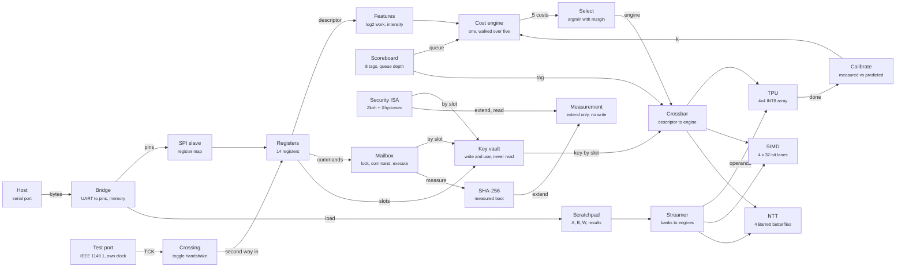

# HYDRA-130 architecture

Generated by `tools/gen_site.py`; run `make site-check` to prove it
still matches the repository. Every block below names a file, and the
generator fails if one of those files is missing.

| block | file |
|---|---|
| Host | `tools/hydra_host.py` |
| Bridge | `fpga/rtl/hydra_fpga_bridge.sv` |
| SPI slave | `tt/tile/src/rtl/hydra_tt_spi.sv` |
| Registers | `tt/tile/src/rtl/hydra_tt_regs.sv` |
| Features | `tt/tile/src/rtl/mom_features.sv` |
| Cost engine | `tt/tile/src/rtl/mom_cost_engine.sv` |
| Select | `tt/tile/src/rtl/mom_select.sv` |
| Scoreboard | `tt/tile/src/rtl/mom_scoreboard.sv` |
| Calibrate | `tt/tile/src/rtl/mom_calibrate.sv` |
| Crossbar | `common/rtl/mom_xbar.sv` |
| TPU | `engines/tpu/rtl/tpu_top.sv` |
| SIMD | `engines/simd/rtl/simd_top.sv` |
| NTT | `engines/ntt/rtl/ntt_top.sv` |
| Streamer | `mem/rtl/hydra_dma_gemm.sv` |
| Scratchpad | `mem/rtl/hydra_spram.sv` |
| Test port | `dbg/rtl/hydra_jtag_tap.sv` |
| Crossing | `dbg/rtl/hydra_jtag_bridge.sv` |
| Security ISA | `isa/rtl/hydra_xsec_unit.sv` |
| Measurement | `sec/rtl/hydra_pcr.sv` |
| SHA-256 | `sec/rtl/hydra_sha256.sv` |
| Mailbox | `sec/rtl/hydra_mailbox.sv` |
| Key vault | `sec/rtl/hydra_key_vault.sv` |
